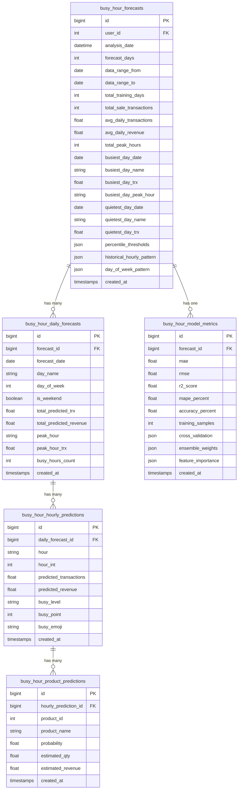

# Database Schema — Busy Hour Prediction

## Kamu Butuh Database Apa?

**MySQL atau PostgreSQL** — keduanya cocok. Karena project kasir ini kemungkinan pakai **Laravel** (dilihat dari format `trx.json`-nya), maka **MySQL** paling natural.

---

## Tabel Baru yang Dibutuhkan

Dari return data endpoint `POST /api/predict/busy-hours`, kamu butuh **5 tabel baru**:



---

## Detail Per Tabel

### 1. `busy_hour_forecasts` — Master forecast session

> Menyimpan 1 record setiap kali user menjalankan prediksi.

| Column | Type | Dari Response Field |
|--------|------|-------------------|
| `id` | BIGINT PK | auto |
| `user_id` | BIGINT FK → users | dari auth |
| `analysis_date` | DATETIME | `analysis_date` |
| `forecast_days` | INT | `forecast_days` |
| `data_range_from` | DATE | `data_range.from` |
| `data_range_to` | DATE | `data_range.to` |
| `total_training_days` | INT | `data_range.total_training_days` |
| `total_sale_transactions` | INT | `data_range.total_sale_transactions` |
| `avg_daily_transactions` | DECIMAL(10,2) | `summary.avg_daily_transactions` |
| `avg_daily_revenue` | DECIMAL(15,2) | `summary.avg_daily_revenue` |
| `total_peak_hours` | INT | `summary.total_peak_hours` |
| `busiest_day_date` | DATE | `summary.busiest_predicted_day.date` |
| `busiest_day_name` | VARCHAR(20) | `summary.busiest_predicted_day.day_name` |
| `busiest_day_trx` | DECIMAL(10,2) | `summary.busiest_predicted_day.total_transactions` |
| `busiest_day_peak_hour` | VARCHAR(10) | `summary.busiest_predicted_day.peak_hour` |
| `quietest_day_date` | DATE | `summary.quietest_predicted_day.date` |
| `quietest_day_name` | VARCHAR(20) | `summary.quietest_predicted_day.day_name` |
| `quietest_day_trx` | DECIMAL(10,2) | `summary.quietest_predicted_day.total_transactions` |
| `percentile_thresholds` | JSON | `percentile_thresholds` |
| `historical_hourly_pattern` | JSON | `historical_hourly_pattern` |
| `day_of_week_pattern` | JSON | `day_of_week_pattern` |
| `top_5_peak_hours` | JSON | `summary.top_5_peak_hours` |
| `created_at` | TIMESTAMP | auto |
| `updated_at` | TIMESTAMP | auto |

### 2. `busy_hour_model_metrics` — Akurasi model

> 1 record per forecast. Menyimpan semua metrics ML.

| Column | Type | Dari Response Field |
|--------|------|-------------------|
| `id` | BIGINT PK | auto |
| `forecast_id` | BIGINT FK → busy_hour_forecasts | relasi |
| `mae` | DECIMAL(10,4) | `model_accuracy.mae` |
| `rmse` | DECIMAL(10,4) | `model_accuracy.rmse` |
| `r2_score` | DECIMAL(10,4) | `model_accuracy.r2_score` |
| `mape_percent` | DECIMAL(10,2) | `model_accuracy.mape_percent` |
| `accuracy_percent` | DECIMAL(10,2) | `model_accuracy.accuracy_percent` |
| `training_samples` | INT | `model_accuracy.training_samples` |
| `cross_validation` | JSON | `model_accuracy.cross_validation` |
| `ensemble_weights` | JSON | `model_accuracy.ensemble_weights` |
| `feature_importance` | JSON | `model_accuracy.feature_importance_rf` |

### 3. `busy_hour_daily_forecasts` — Prediksi per hari

> 14 records per forecast (1 per hari yang diprediksi).

| Column | Type | Dari Response Field |
|--------|------|-------------------|
| `id` | BIGINT PK | auto |
| `forecast_id` | BIGINT FK → busy_hour_forecasts | relasi |
| `forecast_date` | DATE | `daily_forecasts[].date` |
| `day_name` | VARCHAR(20) | `daily_forecasts[].day_name` |
| `day_of_week` | TINYINT | `daily_forecasts[].day_of_week` |
| `is_weekend` | BOOLEAN | `daily_forecasts[].is_weekend` |
| `total_predicted_trx` | DECIMAL(10,2) | `daily_forecasts[].total_predicted_transactions` |
| `total_predicted_revenue` | DECIMAL(15,2) | `daily_forecasts[].total_predicted_revenue` |
| `peak_hour` | VARCHAR(10) | `daily_forecasts[].peak_hour` |
| `peak_hour_trx` | DECIMAL(10,2) | `daily_forecasts[].peak_hour_transactions` |
| `busy_hours_count` | INT | `daily_forecasts[].busy_hours_count` |

### 4. `busy_hour_hourly_predictions` — Prediksi per jam

> ~14 records per daily forecast (1 per jam operasional 07:00-20:00).
> Total: ~196 records per forecast session.

| Column | Type | Dari Response Field |
|--------|------|-------------------|
| `id` | BIGINT PK | auto |
| `daily_forecast_id` | BIGINT FK → busy_hour_daily_forecasts | relasi |
| `hour` | VARCHAR(10) | `hourly_breakdown[].hour` |
| `hour_int` | TINYINT | `hourly_breakdown[].hour_int` |
| `predicted_transactions` | DECIMAL(10,2) | `hourly_breakdown[].predicted_transactions` |
| `predicted_revenue` | DECIMAL(15,2) | `hourly_breakdown[].predicted_revenue` |
| `busy_level` | ENUM('PEAK','HIGH','MEDIUM','LOW','CLOSED') | `hourly_breakdown[].busy_level` |
| `busy_point` | TINYINT | `hourly_breakdown[].busy_point` |

### 5. `busy_hour_product_predictions` — Prediksi produk per jam

> ~3-6 records per hourly prediction.
> Total: ~600-1200 records per forecast session.

| Column | Type | Dari Response Field |
|--------|------|-------------------|
| `id` | BIGINT PK | auto |
| `hourly_prediction_id` | BIGINT FK → busy_hour_hourly_predictions | relasi |
| `product_id` | INT FK → products | `predicted_products[].product_id` |
| `product_name` | VARCHAR(255) | `predicted_products[].product_name` |
| `probability` | DECIMAL(5,3) | `predicted_products[].probability` |
| `estimated_qty` | DECIMAL(10,1) | `predicted_products[].estimated_qty` |
| `estimated_revenue` | DECIMAL(15,2) | `predicted_products[].estimated_revenue` |

---

## Volume Estimate Per 1x Predict

| Tabel | Records |
|-------|---------|
| `busy_hour_forecasts` | 1 |
| `busy_hour_model_metrics` | 1 |
| `busy_hour_daily_forecasts` | 14 |
| `busy_hour_hourly_predictions` | ~196 |
| `busy_hour_product_predictions` | ~800 |
| **Total** | **~1,012 records** |

---

## Laravel Migration (MySQL)

```php
// 1. busy_hour_forecasts
Schema::create('busy_hour_forecasts', function (Blueprint $table) {
    $table->id();
    $table->foreignId('user_id')->constrained();
    $table->dateTime('analysis_date');
    $table->integer('forecast_days');
    $table->date('data_range_from');
    $table->date('data_range_to');
    $table->integer('total_training_days');
    $table->integer('total_sale_transactions');
    $table->decimal('avg_daily_transactions', 10, 2);
    $table->decimal('avg_daily_revenue', 15, 2);
    $table->integer('total_peak_hours');
    $table->date('busiest_day_date');
    $table->string('busiest_day_name', 20);
    $table->decimal('busiest_day_trx', 10, 2);
    $table->string('busiest_day_peak_hour', 10);
    $table->date('quietest_day_date');
    $table->string('quietest_day_name', 20);
    $table->decimal('quietest_day_trx', 10, 2);
    $table->json('percentile_thresholds');
    $table->json('historical_hourly_pattern');
    $table->json('day_of_week_pattern');
    $table->json('top_5_peak_hours');
    $table->timestamps();
});

// 2. busy_hour_model_metrics
Schema::create('busy_hour_model_metrics', function (Blueprint $table) {
    $table->id();
    $table->foreignId('forecast_id')->constrained('busy_hour_forecasts')->cascadeOnDelete();
    $table->decimal('mae', 10, 4);
    $table->decimal('rmse', 10, 4);
    $table->decimal('r2_score', 10, 4);
    $table->decimal('mape_percent', 10, 2);
    $table->decimal('accuracy_percent', 10, 2);
    $table->integer('training_samples');
    $table->json('cross_validation');
    $table->json('ensemble_weights');
    $table->json('feature_importance');
    $table->timestamps();
});

// 3. busy_hour_daily_forecasts
Schema::create('busy_hour_daily_forecasts', function (Blueprint $table) {
    $table->id();
    $table->foreignId('forecast_id')->constrained('busy_hour_forecasts')->cascadeOnDelete();
    $table->date('forecast_date');
    $table->string('day_name', 20);
    $table->tinyInteger('day_of_week');
    $table->boolean('is_weekend');
    $table->decimal('total_predicted_trx', 10, 2);
    $table->decimal('total_predicted_revenue', 15, 2);
    $table->string('peak_hour', 10);
    $table->decimal('peak_hour_trx', 10, 2);
    $table->integer('busy_hours_count');
    $table->timestamps();
});

// 4. busy_hour_hourly_predictions
Schema::create('busy_hour_hourly_predictions', function (Blueprint $table) {
    $table->id();
    $table->foreignId('daily_forecast_id')->constrained('busy_hour_daily_forecasts')->cascadeOnDelete();
    $table->string('hour', 10);
    $table->tinyInteger('hour_int');
    $table->decimal('predicted_transactions', 10, 2);
    $table->decimal('predicted_revenue', 15, 2);
    $table->enum('busy_level', ['PEAK', 'HIGH', 'MEDIUM', 'LOW', 'CLOSED']);
    $table->tinyInteger('busy_point');
    $table->timestamps();
});

// 5. busy_hour_product_predictions
Schema::create('busy_hour_product_predictions', function (Blueprint $table) {
    $table->id();
    $table->foreignId('hourly_prediction_id')->constrained('busy_hour_hourly_predictions')->cascadeOnDelete();
    $table->unsignedBigInteger('product_id');
    $table->string('product_name');
    $table->decimal('probability', 5, 3);
    $table->decimal('estimated_qty', 10, 1);
    $table->decimal('estimated_revenue', 15, 2);
    $table->timestamps();

    $table->foreign('product_id')->references('id')->on('products');
});
```

> [!TIP]
> Semua child table pakai `cascadeOnDelete()` — jadi kalau forecast dihapus, semua data turunannya ikut terhapus otomatis.

> [!IMPORTANT]
> Field yang disimpan sebagai `JSON` (`percentile_thresholds`, `historical_hourly_pattern`, `day_of_week_pattern`, `top_5_peak_hours`, `cross_validation`, `ensemble_weights`, `feature_importance`) dipilih karena datanya bersifat snapshot/metadata yang jarang di-query secara individual. Kalau nanti perlu di-query, bisa di-normalize ke tabel sendiri.
