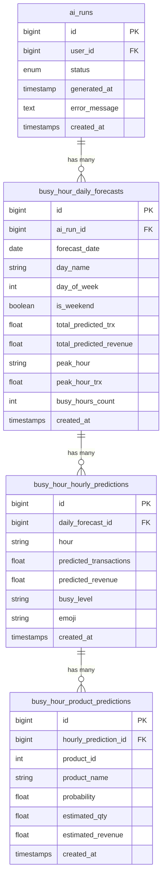

# Database Schema — Busy Hour Prediction (Updated)

## Database

**MySQL** — karena project kasir ini pakai **Laravel**, MySQL paling natural.

---

## Tabel yang Dibutuhkan

Dari return data endpoint `POST /api/predict/busy-hours`, kamu butuh **3 tabel**.  
Data summary (accuracy, busiest_day, dll) **tidak disimpan ke DB** — langsung dipakai di response saja.  
Semua tabel terhubung ke `ai_runs` sebagai parent session.



---

## Detail Per Tabel

### 1. `busy_hour_daily_forecasts` — Prediksi per hari

> 14 records per AI run (1 per hari yang diprediksi).
> Terhubung langsung ke `ai_runs`.

| Column | Type | Dari Response |
|--------|------|---------------|
| `id` | BIGINT PK | auto |
| `ai_run_id` | BIGINT FK → ai_runs | relasi |
| `forecast_date` | DATE | `daily_forecasts[].date` |
| `day_name` | VARCHAR(20) | `daily_forecasts[].day_name` |
| `day_of_week` | TINYINT | `daily_forecasts[].day_of_week` |
| `is_weekend` | BOOLEAN | `daily_forecasts[].is_weekend` |
| `total_predicted_trx` | DECIMAL(10,2) | `daily_forecasts[].total_predicted_transactions` |
| `total_predicted_revenue` | DECIMAL(15,2) | `daily_forecasts[].total_predicted_revenue` |
| `peak_hour` | VARCHAR(10) | `daily_forecasts[].peak_hour` |
| `peak_hour_trx` | DECIMAL(10,2) | `daily_forecasts[].peak_hour_transactions` |
| `busy_hours_count` | INT | `daily_forecasts[].busy_hours_count` |

### 2. `busy_hour_hourly_predictions` — Prediksi per jam

> ~14 records per daily forecast (07:00-20:00).
> Total: ~196 records per AI run session.

| Column | Type | Dari Response |
|--------|------|---------------|
| `id` | BIGINT PK | auto |
| `daily_forecast_id` | BIGINT FK → busy_hour_daily_forecasts | relasi |
| `hour` | VARCHAR(10) | `hourly_breakdown[].hour` |
| `predicted_transactions` | DECIMAL(10,2) | `hourly_breakdown[].predicted_transactions` |
| `predicted_revenue` | DECIMAL(15,2) | `hourly_breakdown[].predicted_revenue` |
| `busy_level` | ENUM('PEAK','HIGH','MEDIUM','LOW','CLOSED') | `hourly_breakdown[].busy_level` |
| `emoji` | VARCHAR(10) | `hourly_breakdown[].emoji` |

### 3. `busy_hour_product_predictions` — Prediksi produk per jam

> ~3-6 records per hourly prediction.
> Total: ~600-1200 records per AI run session.

| Column | Type | Dari Response |
|--------|------|---------------|
| `id` | BIGINT PK | auto |
| `hourly_prediction_id` | BIGINT FK → busy_hour_hourly_predictions | relasi |
| `product_id` | INT FK → products | `predicted_products[].product_id` |
| `product_name` | VARCHAR(255) | `predicted_products[].product_name` |
| `probability` | DECIMAL(5,3) | `predicted_products[].probability` |
| `estimated_qty` | DECIMAL(10,1) | `predicted_products[].estimated_qty` |
| `estimated_revenue` | DECIMAL(15,2) | `predicted_products[].estimated_revenue` |

---

## Volume Estimate Per 1x AI Run

| Tabel | Records |
|-------|---------|
| `busy_hour_daily_forecasts` | 14 |
| `busy_hour_hourly_predictions` | ~196 |
| `busy_hour_product_predictions` | ~800 |
| **Total** | **~1,010 records** |

---

## Response Fields TIDAK Disimpan ke DB

Data berikut langsung dipakai di response saja, tidak perlu tabel terpisah:

| Field | Alasan |
|-------|--------|
| `analysis_date` | Sudah ada di `ai_runs.generated_at` |
| `forecast_days` | Konstanta (14) |
| `accuracy_percent` | Metric sementara, berubah tiap run |
| `training_samples` | Metric sementara |
| `data_range` | Bisa dihitung ulang dari data |
| `busiest_day` | Bisa dihitung dari `busy_hour_daily_forecasts` |
| `quietest_day` | Bisa dihitung dari `busy_hour_daily_forecasts` |
| `avg_daily_transactions` | Bisa dihitung dari `busy_hour_daily_forecasts` |
| `avg_daily_revenue` | Bisa dihitung dari `busy_hour_daily_forecasts` |
| `total_peak_hours` | Bisa dihitung dari `busy_hour_hourly_predictions` |
| `top_peak_hours` | Bisa dihitung dari `busy_hour_hourly_predictions` |

---

## Mapping Response → Tabel

```
Response JSON                          → Tabel
─────────────────────────────────────────────────────
daily_forecasts[]                      → busy_hour_daily_forecasts (ai_run_id)
daily_forecasts[].hourly_breakdown[]   → busy_hour_hourly_predictions
hourly_breakdown[].predicted_products[]→ busy_hour_product_predictions
```

> [!TIP]
> Semua child table pakai `cascadeOnDelete()` — kalau `ai_run` dihapus, semua data busy hour turunannya ikut terhapus otomatis.

> [!IMPORTANT]
> Summary fields (accuracy, busiest_day, dll) **tidak disimpan ke DB** karena bisa dihitung ulang dari data yang tersimpan, atau hanya dipakai sekali di response.
